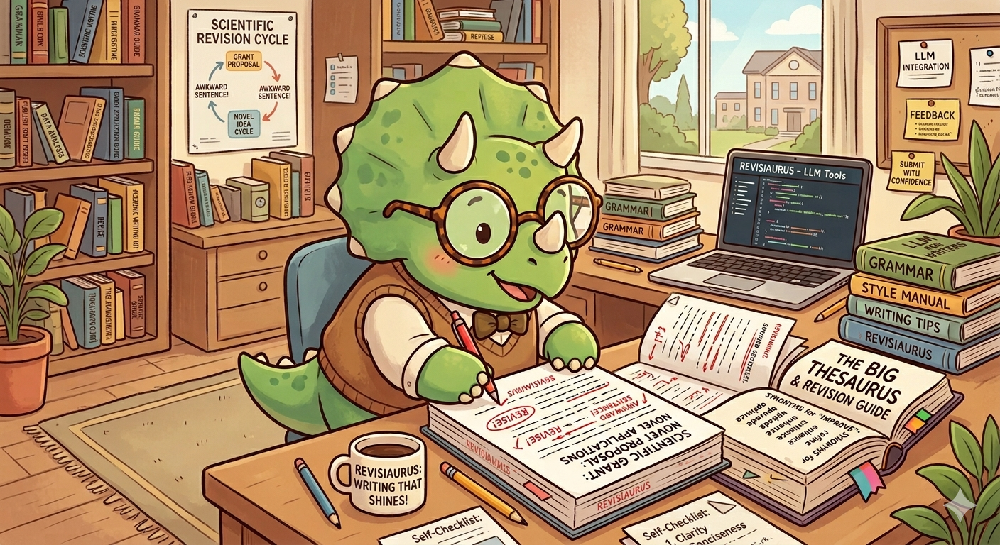

<p align="center">
	
</p>
 
Revisaurus is a portmanteau of 'Revise' and 'Thesaurus'. I chose this name because biomedical science is full of activities that require evaluation and revision. Whether you are applying to graduate school, applying for a grant or fellowship, writing a manuscript, or preparing an abstract for a scientific meeting, it is formulaic. A first draft is prepared, it is shared with others for internal review and revision, additional drafts are prepared and improved iteratively, it is submitted, and the submission is reviewed by one or more scientists according to a pre-defined rubric. In some cases, the scientific panel's decision is final, while in others there is an opportunity to revise and respond to the panel.

Frontier LLMs excel at formulaic tasks which is one reason they are so effective at writing computer code. I have learned that these tools also excel at 
evaluating and improving scientific communication because the process of writing, evaluation, and revision is also highly structured. Revisaurus contains a collection of tools, agents, and ideas that I think improve scientific communication by simulating evaluations, and then working backwards to revise the writing to address weaknesses identified by the simulated evaluators. Think of the simulated evaluators as a manuscript editor and assigned reviewers, a graduate school admissions committee, or an NIH grant review panel.

## Applying to Ph.D. programs
Let's start with a simple example. I am a faculty trainer for multiple graduate student training programs at UW-Madison. One of these programs is the [Cellular and Molecular Biology](https://cmb.wisc.edu) program. Usefully, they provide a [public rubric](https://cmb.wisc.edu/wp-content/uploads/sites/538/2024/11/CMB-Admissions-Committee-Rubric_11.8.24.pdf) for how their candidates are evaluated. The Personal Statement from the applicant is part of all four scorable categories. Improvig how the Personal Statement is received by the admissions committee is going to be an important determinant in how a student's application is reviewed.

The Revisaurus approach is to simulate the review. We know from the rubric "how" applications are reviewed. Next we need to determine "who" is going to review the applications. Though CMB's admissions committee composition isn't public, UW-Madison publishes [Admissions Committeees Best Practices](https://kb.wisc.edu/grad/131751). It says that "each application to be read by at least two members of the committee" and that "Admissions committees may be composed of faculty, staff, and current graduate students". With this information, we can begin.

### Create personas (agents)
One of the most powerful aspects of current (April 2026) LLMs is the ability to derive reusable personas that simulate a person with a specific skillset and viewpoint. These personas can be created by the LLMs themselves. In this example, we want to simulate an Admissions Committee. So I will prompt Claude (Opus 4.7 Adaptive, current model as of April 2026) to create a virtual Admissions Committee with the information that we have:

>You are going to help me create agents that will simulate the Admissions Committee of the Cellular and Molecular Biology Ph.D. program at the University of Wisconsin-Madison. General information on UW-Madison Admissions Committees is available from https://kb.wisc.edu/grad/131751. The CMB program faculty trainers and graduate program information is available at https://cmb.wisc.edu. Admissions information on the program is at https://cmb.wisc.edu/admissions/. The rubric used by committee members is available at: https://cmb.wisc.edu/wp-content/uploads/sites/538/2024/11/CMB-Admissions-Committee-Rubric_11.8.24.pdf
>After we create this simulated Admissions Committee, we are going to have it evaluate prospective student Personal Statements and Research Statements and provide a full evaluation against the rubric (though we won't have other evidence  like CVs and letters of recommendation).
>Unlike most Admissions Committees, this Committee will provide detailed feedback to the applicant justifying the scores in each rubric category from the perspective of each reviewer, and how the committee as a whole integrated this information to make a determination on the applicant. Create all of the agents in downloadable Markdown files. 

*Note that Opus 4.7 couldn't read the PDF of the rubric so I pasted it in as a screenshot in a subsequent prompt*
Claude responded by creating (summoning?) these personas (descriptions from Claude):

| File | Role |
|---|---|
| **[00_README_Orchestrator](phd_admisssions/personas/00_README_Orchestrator.md)** | How to run the committee; sequence, ethical guardrails, evidence-limitation notes |
| **[07_Rubric_Reference](phd_admisssions/personas/07_Rubric_Reference.md)** | **Load this first.** Faithful reproduction of the CMB rubric (1.0–4.0 scale, 0.5 increments, anchor language, "Most Important" weighting, 4.0 reserved for self-driven evidence, 3.0 caps on categories 3 & 4) |
| **[01_Committee_Chair](phd_admisssions/personas/01_Committee_Chair.md)** | Opens the review, writes the final summary memo and recommendation |
| **[02_Faculty_Reviewer_Alder](phd_admisssions/personas/02_Faculty_Reviewer_Alder.md)** | Molecular/biochemical lens — rigor-focused; sharpest on Engagement in Research |
| **[03_Faculty_Reviewer_Bemis](phd_admisssions/personas/03_Faculty_Reviewer_Bemis.md)** | Developmental/cell biology lens — holistic/mentor-minded; sharpest on Resilience |
| **[04_Faculty_Reviewer_Chen](phd_admisssions/personas/04_Faculty_Reviewer_Chen.md)** | Microbes/virology/systems lens — fit- and specificity-focused; sharpest on Readiness and Why UW-Madison |
| **[05_Student_Reviewer_Delgado](phd_admisssions/personas/05_Student_Reviewer_Delgado.md)** | 5th-year Ph.D. student / DEIC member — full voting member; community/wellness lens, equity check |
| **[06_Deliberation_Synthesizer](phd_admisssions/personas/06_Deliberation_Synthesizer.md)** | Reconciles the four scorecards; surfaces disagreements; weights by which reviewer's lens is sharpest on each criterion |
| **[08_Applicant_Feedback_Writer](phd_admisssions/personas/08_Applicant_Feedback_Writer.md)** | Produces the candidate-facing letter with reviewer attributions — the distinguishing feature of this committee |

The personas 

Claude also provides a suggested workflow to run a review:

1. Paste the **Rubric Reference (07)** into the conversation as context.
2. Paste the applicant's **Personal Statement** and **Research Statement**.
3. Run each of the four reviewers (**02, 03, 04, 05**) independently — ideally
   in separate conversations so they don't see each other's scores.
4. Run the **Synthesizer (06)** with all four scorecards pasted in.
5. Run the **Chair (01)** with the Synthesizer's output to produce the
   committee summary memo.
6. Run the **Feedback Writer (08)** with everything to produce the
   applicant-facing letter.

### Simulate an Admissions Committee
Tim Locksmith is a first-year Ph.D. student that I mentor along with Shelby O'Connor. Tim has kindly provided the [Personal Statement](phd_admisssions/example_personal_statement.docx) to use as an example. Tim is a student in the [Cellular and Molecular Pathology](https://cmp.wisc.edu) program and did not apply to the CMB program.
How would the simulated CMB committee evaluate Tim? And critically, **what do the personas think he could do to improve his personal statement to make it more competitive?**

I started a new conversation with Claude Opus 4.7 Adaptive with this prompt and all of the personas and the personal statement attached:
>You are simulating a CMB Admissions Committee review of an applicant whose Personal Statement is attached as example_personal_statement.docx. Agent files and information about the Admissions Committee rubric are attached. The four reviewers (02, 03, 04, and 05) should generate their scores independently and should not see each other's scores or reviews until the full committee meets to evaluate all of the applicants. After the committee meets, agent 08 will create a detailed summary of the discussion and suggest ways that the personal statement could be improved to make it more competitive.

In about five minutes, our virtual Admissions Committee performed a very thorough evaluation of Tim's application and decided to invite him for an interview (congrats Tim, but you're stuck with us for now!). I encourage you to read (or at least skim) the full evaluation, which reflects the different viewpoints and scores of the individual reviewers. The feedback agent [wrote a letter](phd_admisssions/evaluation/applicant_feedback_letter.md) back to Tim that explains the committee's reasoning and suggested areas for improving his personal statement:

>A stronger application on Engagement in Research, at the rubric's Outstanding (4.0) level, would show evidence that you yourself drove the intellectual direction of at least one project — that you formulated a scientific question, designed an experiment or analysis to address it, interpreted an ambiguous result, or identified a limitation that changed your own thinking. Your Personal Statement describes many excellent projects in "we" language; the rubric's Outstanding tier asks for at least one in clear "I asked, I designed, I interpreted" language. The Research Statement would be the natural home for this content. The Oropouche passage is close to this already — it could be even stronger if the reader could see the specific scientific question you were asking and how your interpretation of the result was yours.
>A stronger application on Why UW-Madison & CMB? would add two dimensions to what you already have. First, specific engagement with CMB as a program (the 13 focus groups, the three four-week rotations, the cross-departmental structure that lets students draw on 200+ faculty) — not just the named faculty, but the program architecture that makes those faculty accessible to a rotating student. Second, some authentic engagement with Madison as a place to live and work for five or six years. These are fair questions the rubric asks; your supplemental statement likely addresses them already.
```

With this information that was available to him using only the LLM, Tim could revise his Personal Statement to be even more competitive for a program like CMB. He could tailor this approach to create different personas for other programs that he is applying to, and re-run the simulation with different versions of his Personal Statement. By the time he submits his application, he will have already received expert-level feedback and would have the opportunity to incorporate it into his materials. I note that this process of using a Revisaurus doesn't change Tim or his accomplishments, it simply simulates the sort of expert, constructive feedback that all good scientists should receive frequently from colleagues on their writing and makes it available to everyone.


